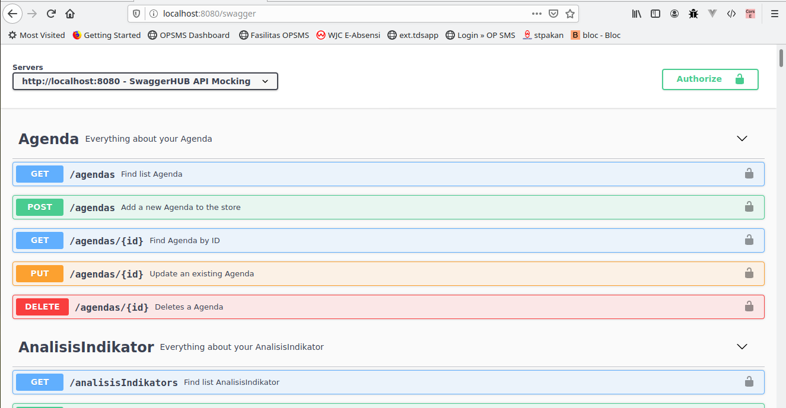

# easyAPI

## What is easyAPI?

easyAPI is skeleton REST API application and integrated with swagger to generate documentation API.
With easyAPI you can generate REST API less than 5 minutes.

## Installation & setup

- clone this repository `git clone https://github.com/pandigresik/easyAPI.git` 
- `cd easyAPI`
- `composer install` to install dependency this application
- change your `secret` key in `app/Config/Services.php` on line 22
- `php spark serve` to run this application, default you can open this address http://localhost:8080 on your browser
- Copy `env` to `.env` and tailor for your app, specifically the baseURL and any database settings.

## Generate REST API
- `php spark api:generate`
after that, system will ask you table name will generate that REST API. We can choose one table or all, if we want generate all write `all` or write one table name exist in your database
If there is no error, system will generate for you controller, model and entity file.
- Last you must add new route will display in last command to `app/Config/Routes.php`.
- Generate api.yaml using command `./vendor/bin/openapi -o ./public/assets/api.yaml ./app` to show API docs using swagger using datasource format yaml (default)
- Generate api.json using command `./vendor/bin/openapi -o ./public/assets/api.json ./app` to show API docs using swagger using datasource format json (optional)
- Open API documentation in http://localhost:8080/swagger

## Example case 
- join with other table, you can look at [ArtikelKategoriModel.php](https://github.com/pandigresik/easyAPI/blob/master/app/Models/ArtikelKategoriModel.php)
- example parameter in swagger for order data *{"order":[{"id":"desc"},{"tgl_upload":"asc"}]}*
- example parameter in swagger for search data *{"search":[{"id_kategori":1}]}*
- example parameter in swagger for search range data *{"search":[{"tgl_upload":{"start":"2016-01-01", "end":"2020-01-01"} }]}*
- example parameter in swagger for search using like *{"search":[{"judul":"membangun%25"}]}* or *{"search":[{"judul":"%25membangun%25"}]}* use `%25` not `%` you can place `%25` on before, after and combination before and after as your keyword to search data 
- search data based on column name *{base_url}/artikels?search[id_kategori]=1*
- order data based on column name *{base_url}/artikels?order[id]=desc&order[tgl_upload]=asc*
- search and order data based on column name *{base_url}/artikels?search[id_kategori]=1&order[id]=desc&order[tgl_upload]=asc*
- search with pagination *{base_url}/artikels?page=1&limit=10*
- search and order with pagination *{base_url}/artikels?search[id_kategori]=1&order[id]=desc&order[tgl_upload]=asc&page=1&limit=10*
- search using between operator if we want filter data based range of date or etc *{base_url}/artikels?search[tgl_upload][start]=2016-01-01&search[tgl_upload][end]=2020-01-01*
- search using keyword *{base_url}/artikels?search[judul]=membangun%25* or *{base_url}/artikels?search[judul]=%25membangun%25* will produce like operator on query

## Video demo installation

## Video swagger documentation generate by easyAPI

## Preview

## Todo
- [X] create example using this application

## Copyright

easyApi dikembangkan dan dimaintain oleh [asligresik](https://github.com/pandigresik)

## Lisensi

Lisensi dari easyApi adalah [MIT License](LICENSE) namun proyek yang dibangun menyeseuaikan dengan kebijakan masing-masing